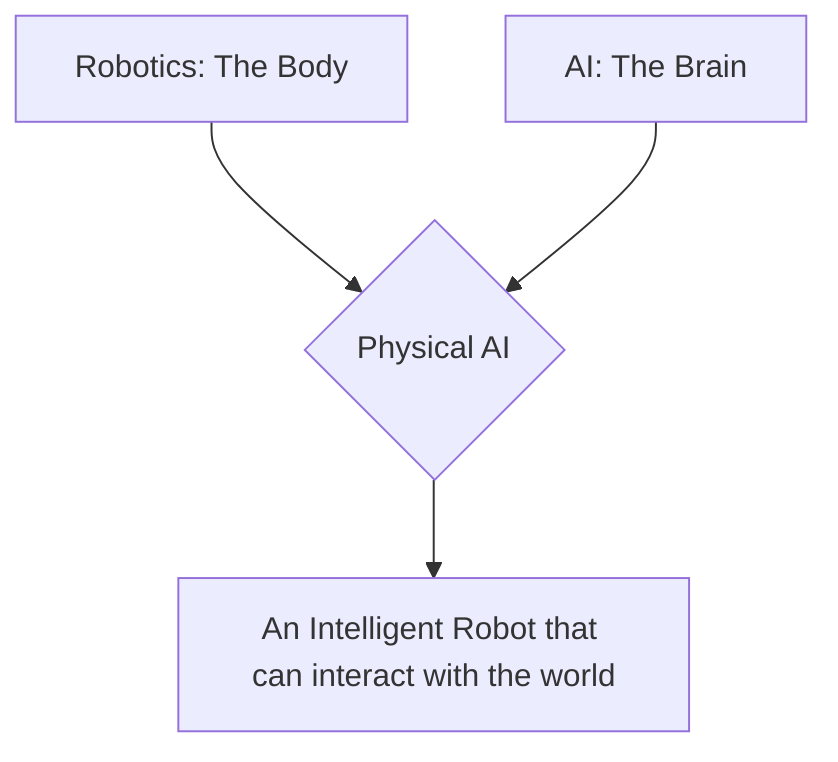

# Chapter 1: Detailed Explanation

## What is Physical AI?

For a long time, Artificial Intelligence was something that lived entirely inside computers. Think of a chess-playing program or a language translator—they are very smart, but they don't have a body. They can't move around in your room or hand you a cup of coffee.

**Physical AI** changes that. It's the combination of a "brain" (the AI software) and a "body" (the robot hardware). This body allows the AI to interact with the physical world in a meaningful way.

- **The Brain (AI):** This is the part of the system that thinks, learns, and makes decisions. It processes information from the robot's sensors and decides what to do next.
- **The Body (Hardware):** This is the physical structure of the robot—its limbs, wheels, joints, and sensors. The body is what actually performs the actions in the real world.

The magic of Physical AI is that the brain and body work together. The AI's intelligence is "embodied," which means its understanding of the world is based on its physical experiences.

### The Importance of Embodiment

Imagine trying to learn how to ride a bike by only reading books about it. You could learn the theory—how to balance, pedal, and steer—but you wouldn't *really* know how to ride until you got on a bike and felt the wobble, the push of the pedals, and the wind in your face.

This is the core idea of **embodiment**. A Physical AI learns by *doing*.

- A robot arm learns how to pick up an egg without breaking it by trying and failing, feeling the pressure with its touch sensors.
- A walking robot learns to navigate a rocky path by feeling the ground tilt and adjusting its balance.

This physical experience gives the AI a much deeper and more practical form of intelligence than a purely software-based AI could ever have.

### The Link Between AI and Robotics

It's easy to get "AI" and "robotics" mixed up. Here’s a simple way to think about it:

- **Robotics** is the field of engineering that deals with designing, building, and operating robots. It's focused on the physical body. A simple factory robot arm that just repeats the same motion over and over is a product of robotics.
- **Artificial Intelligence** is the field of computer science focused on creating machines that can think and learn. A chatbot is an AI.

**Physical AI is where these two fields meet.** It's about putting a smart brain (AI) into a capable body (a robot).

### Challenges in Building Physical AI

Creating intelligent robots is incredibly difficult. Here are some of the biggest challenges:

1.  **Complexity of the Real World:** The real world is messy and unpredictable. A robot has to be able to deal with things it has never seen before, like a person suddenly walking in front of it or a floor being slippery.
2.  **Hardware Limitations:** Building a robot body that is as agile and capable as a human is a huge challenge. We are still far from creating hands that can feel and move with the same dexterity as human hands.
3.  **Power Consumption:** Running powerful AI programs and moving a physical body requires a lot of energy. Making batteries that are small, light, and long-lasting is a constant struggle.
4.  **Safety:** A powerful robot that makes a mistake can be dangerous. Ensuring that Physical AI systems are safe to operate around humans is a top priority.
