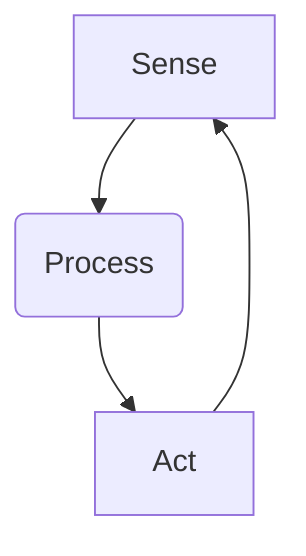
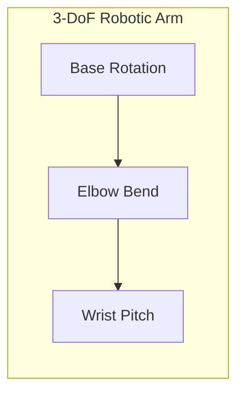

# Chapter 2: Detailed Explanation

In the last chapter, we learned that a Physical AI needs a body. That body is a **robot**. But what exactly makes something a robot?

A simple remote-control car isn't a robot. A toaster isn't a robot. To be considered a robot, a machine needs three things:

1.  **Sensing:** It must be able to perceive its environment using sensors.
2.  **Processing:** It must be able to process the information from its sensors and make a decision. This is done by the **controller**.
3.  **Acting:** It must be able to perform a physical action using **actuators**.

This "Sense-Process-Act" loop is the fundamental principle of all robotics.

### The Core Components of a Robot

Every robot, from a simple toy to a complex humanoid, is made of the same basic building blocks.

-   **Frame (or Chassis):** This is the robot's skeleton. It can be made of plastic, metal, or composite materials. The frame gives the robot its shape and holds everything together.
-   **Power Source:** Robots need energy to work. For mobile robots, this is usually a rechargeable battery. For large, stationary robots (like those in a factory), it's often a direct connection to the electrical grid.
-   **Controller:** This is the onboard computer that acts as the nervous system. It runs the software that makes the robot work. It takes input from the sensors and sends output commands to the actuators.
-   **Sensors:** The robot's senses. We will cover these in detail in the next chapter, but they include things like cameras, microphones, and touch sensors.
-   **Actuators:** The robot's muscles. These are the motors, pistons, or other devices that create movement.

### How Robots Move: Degrees of Freedom (DoF)

A robot's ability to move is described by its **Degrees of Freedom (DoF)**. A "degree of freedom" is a single, independent way a robot can move.

-   Imagine your arm. You can bend your elbow. That's **one** Degree of Freedom.
-   You can also swivel your wrist. That's another DoF.
-   You can rotate your shoulder. That's a few more DoF.

A human arm has about 7 Degrees of Freedom, which is why it's so flexible. A simple robotic arm might only have 3 DoF, making it less agile. The more DoF a robot has, the more complex its movements can be, but the harder it is to control.

### Types of Robot Locomotion

"Locomotion" is just a fancy word for how a robot gets around.

-   **Wheeled Robots:** These are the most common type of mobile robot. They are fast, simple, and energy-efficient on flat surfaces like floors and roads. However, they are not good at handling stairs or rough terrain.
-   **Legged Robots:** Robots with legs, like Boston Dynamics' "Spot" robot dog, are much better at crossing uneven ground. However, they are much more complex to build and control, as they have to constantly worry about balance.
-   **Aerial Robots (Drones):** These robots use propellers to fly. They have incredible freedom of movement but usually have very limited battery life.

### Controlling Movement: Kinematics

Let's say you have a robotic arm. The **controller** needs to know how to move the motors in the joints to place the hand exactly where it needs to be. This is the problem of **kinematics**.

-   **Forward Kinematics:** This is the "easy" direction. If you know the angles of all the joints in the robot's arm, you can calculate the exact position and orientation of its hand. It's just a bit of math.
    -   *Question:* Joint 1 is at 30°, Joint 2 is at 50°. Where is the hand?

-   **Inverse Kinematics:** This is the "hard" direction, but it's what we usually need to do. If you know where you *want* the hand to be, you need to calculate what angles all the joints need to be to get it there. For a robot with many joints, there might be multiple solutions, or even no solution at all!
    -   *Question:* I want the hand to be at position (X, Y, Z). What angles should the joints be?

Inverse kinematics is a classic problem in robotics, and solving it efficiently is crucial for making a robot useful. Modern AI techniques are often used to help solve this complex problem.
