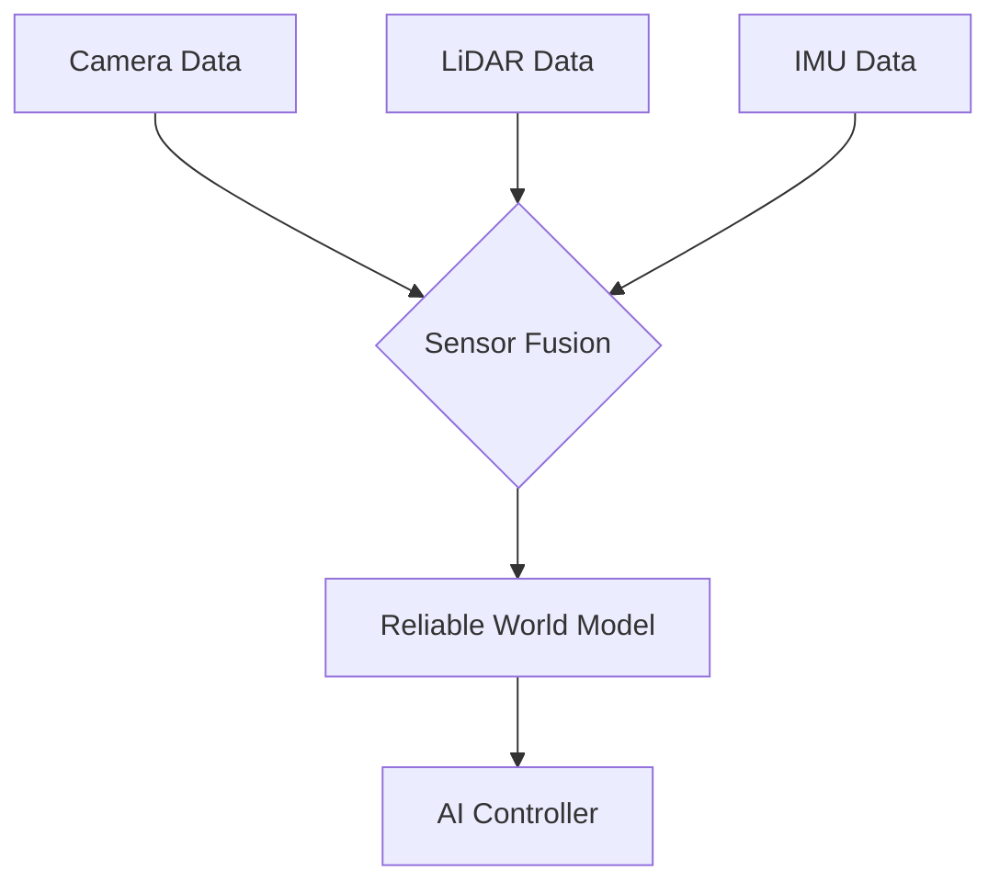

# Chapter 3: Detailed Explanation

In the "Sense-Process-Act" loop, sensors and actuators are the hardware that make the "Sense" and "Act" parts happen.

-   **Sensors** are the inputs: They feed information *to* the robot's controller.
-   **Actuators** are the outputs: They take commands *from* the controller and turn them into action.

### A Deeper Look at Sensors

Sensors are the robot's window to the world. Without them, a robot is just a blind and deaf machine. We can put sensors into two main groups.

#### 1. Proprioceptive Sensors (Sensing Self)

These sensors measure the internal state of the robot. The word comes from *proprioception*, which is your own biological sense of body position.

-   **Joint Angle Sensors (Encoders):** These are one of the most important sensors in any robot with joints. An encoder is attached to a motor and tells the controller the exact angle or position of the joint. This is critical for solving the kinematics problems we discussed in the last chapter.
-   **IMU (Inertial Measurement Unit):** Think of this as the robot's inner ear. It tells the robot if it's accelerating, turning, or tilting. For a walking robot, an IMU is essential for maintaining balance. For a drone, it's what allows it to stay level.

#### 2. Exteroceptive Sensors (Sensing the World)

These sensors gather information about the environment *outside* the robot.

-   **Cameras (Vision):** Cameras are incredibly rich sensors, providing a huge amount of data about the world. Modern AI has made it possible for robots to use this data to recognize objects, identify people, and navigate complex spaces.
-   **LiDAR (3D Vision):** While a camera gives a 2D image, LiDAR builds a 3D "point cloud" of the world. It works by sending out pulses of laser light and measuring how long they take to return. Self-driving cars use LiDAR to create a detailed, 360-degree map of their surroundings, allowing them to see other cars, cyclists, and pedestrians with great accuracy, day or night.
-   **Force-Torque Sensors (Touch):** These sensors allow a robot to feel how hard it is pushing or pulling on something. When a robotic arm assembles a delicate electronic part, it uses force-torque sensors to "feel" when the part is inserted correctly, rather than just forcing it and breaking it.

### The Power of Sensor Fusion

Which is better: a camera or a LiDAR? The answer is: **both!**

A camera is great at recognizing what things are (e.g., "that's a stop sign"), but it's not very good at judging exact distances. LiDAR is excellent at measuring distance and creating a 3D map, but it can't tell the difference between a picture of a person and a real person.

**Sensor fusion** is the technique of combining the strengths of different sensors to overcome their individual weaknesses. A self-driving car fuses data from its cameras, LiDAR, and radar to build a single, comprehensive model of the world that is far more reliable than any one sensor alone.

### A Deeper Look at Actuators

Actuators are what bring the robot to life. The vast majority of robots today use electric motors.

#### 1. DC Motors

This is the simplest type of motor. When you apply power, it spins. The more power, the faster it spins. They are cheap and powerful, making them perfect for driving the **wheels** of a mobile robot. However, they don't offer precise control over position.

#### 2. Servo Motors

A servo motor is a special package that includes a DC motor, a set of gears, and a controller with a position sensor. This allows you to command the motor to go to a specific angle and hold it firmly. For example, you can tell a servo to move to "90 degrees." This makes them the ideal choice for the **joints** of a robotic arm or a humanoid robot's leg.

#### 3. Stepper Motors

A stepper motor moves in a series of small, precise, fixed-angle steps. You can tell it to "move 200 steps forward." This makes them incredibly precise for positioning tasks. You will find stepper motors in machines that require high accuracy, like **3D printers** and **CNC mills**.

#### 4. Other Actuators: Hydraulics and Pneumatics

While less common in mobile robotics, hydraulic (using fluid) and pneumatic (using air) actuators are used when immense force is needed. They can lift incredible weights but are often larger, messier, and harder to control than electric motors. Think of the powerful arms on a piece of construction equipment like an excavator—those are hydraulic.
