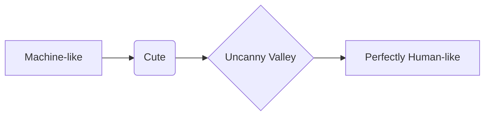

# Chapter 4: Detailed Explanation

Why build a robot that looks like a person? We can build robots with wheels, tracks, or propellers that are often far more efficient. The primary reason for the humanoid form is simple: **we built the world for ourselves.**

Stairs, doors, tools, and kitchen counters are all designed to be used by a human body. A robot with a human-like body (a head for sensors, two arms for manipulation, and two legs for mobility) can, in theory, operate in our environment more easily than a robot of a different shape.

### The Challenge of Walking: Bipedal Locomotion

Walking on two legs is something most of us do without any thought, but for a robot, it's a monumental challenge. It's often described as "controlled falling."

When you walk, you are constantly tipping over and then catching yourself with your next step. This requires a perfect sense of balance and lightning-fast adjustments. For a robot, this is the problem of **dynamic balance**.

#### The Zero Moment Point (ZMP)

To understand how a walking robot stays upright, we need to know about the **Zero Moment Point (ZMP)**.

Imagine a robot standing still on both feet. The area on the floor covered by its feet is its **support polygon**. As long as the robot's center of gravity is projected into a point that stays inside this area, it will be stable.

The ZMP is the point on the ground where all the forces from the robot's motion and gravity balance out. If the ZMP stays inside the support polygon, the robot is stable. If the ZMP moves outside the support polygon, the robot will tip over.

```mermaid
graph TD
    subgraph Stable
        A[Support Polygon (area under feet)] -- ZMP is inside --> B(Robot is Balanced);
    end
    subgraph Unstable
        C[Support Polygon] -- ZMP is outside --> D(Robot Falls Over!);
    end
```

The job of a humanoid robot's controller is to constantly calculate where the ZMP is and adjust the robot's posture—by shifting its hips, bending its knees, or swinging its arms—to keep the ZMP in a stable position under its feet.

### The Challenge of Grasping: Dexterous Manipulation

The second grand challenge of humanoid robotics is building hands that can do what our hands can. The human hand is a marvel of engineering, with over 20 Degrees of Freedom. It can pick up a heavy hammer or a delicate flower.

Replicating this is incredibly hard. Roboticists are trying to create hands with:
- **High DoF:** Many joints to allow for complex finger motions.
- **Sensitive Touch:** Force and tactile sensors in the fingertips to "feel" objects and apply the right amount of pressure.
- **Strong, Fast Actuators:** Tiny but powerful motors to drive the finger joints.

Most "humanoid" robots today still have simple grippers for hands, as creating true human-like dexterity is still an active and difficult area of research.

### The Uncanny Valley

As we get better at making robots look like people, we run into a strange psychological problem: the **Uncanny Valley**.

- **Not human-like at all (e.g., a factory robot arm):** We see it as a machine. No problem.
- **A little human-like (e.g., a toy robot):** We think it's cute.
- **Almost perfectly human-like, but with something *off*:** This is the Uncanny Valley. The robot looks just real enough that our brains expect it to behave exactly like a person. When it doesn't—when its eyes don't blink right, or its skin looks waxy—it creates a strong sense of unease or even revulsion.

Designers of social humanoid robots have to be very careful. Many choose to create robots that are clearly mechanical but have friendly, human-like *features* (like big eyes or a smile) to avoid falling into this trap.


