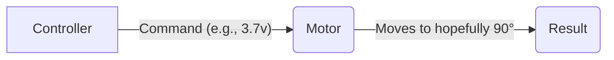
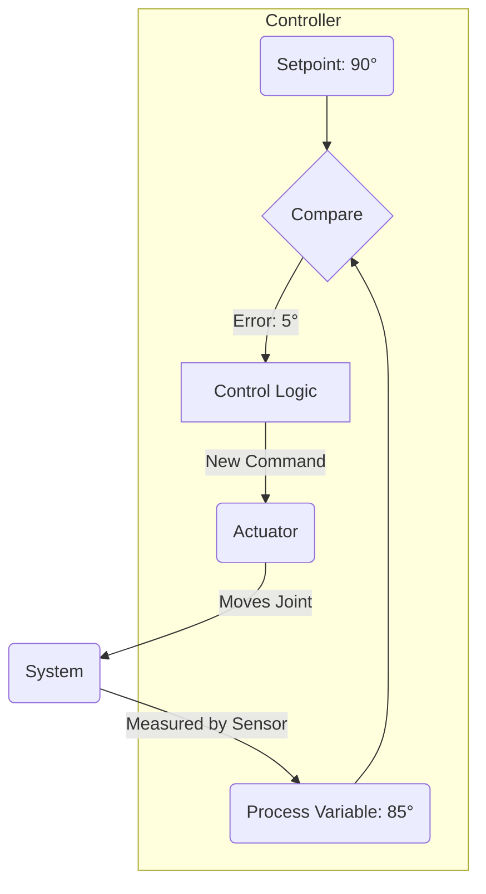

# Chapter 5: Detailed Explanation

An AI might decide, "I need to move my arm to position X." But what does that actually mean? How does that high-level goal get turned into the exact amount of electricity sent to the servo motor in the robot's elbow? That's the job of a **control system**.

### The Problem: The Real World is Imperfect

Imagine you have a simple robotic arm joint, and you want to move it to a 90-degree angle. You could do a few tests and figure out that you need to send exactly 3.7 volts to the motor to make it move there.

This is **Open-Loop Control**. You send the command and *hope* for the best.

What's wrong with this?
- What if the arm is carrying something heavy? The 3.7v might not be enough.
- What if someone gently bumps the arm? It will move out of position.
- What if the motor heats up and its performance changes?

An open-loop system has no way of knowing that it failed. It cannot correct for errors.

### The Solution: Closing the Loop with Feedback

To solve this, we need to add **feedback**. We use a sensor (like a joint encoder) to measure the actual position of the arm—the **Process Variable (PV)**. We compare this to our goal—the **Setpoint (SP)**—to find the **Error**. Then, we use that error to calculate a *new* command for the motor.

This is **Closed-Loop Control**.

Now, if the arm is carrying a heavy load and only gets to 85 degrees, the controller sees the 5-degree error and automatically increases the voltage to the motor until the error is zero. This ability to self-correct is the single most important concept in control theory.

### The Workhorse of Control: The PID Controller

So how does the controller use the error to calculate the right command? The most common way is with a **PID controller**. It's a beautifully simple and powerful idea that combines three different calculations.

Let's imagine you are trying to use a servo motor to move a robot's joint to a specific angle.

#### 1. The Proportional (P) Term

The P term says, "The bigger the error, the harder I push."
- **If you are far from your goal:** Push hard.
- **If you are close to your goal:** Push gently.

This makes intuitive sense. The command is `P * error`. The problem is that just using P control often leads to oscillations (overshooting the target) or a small, persistent "steady-state" error.

#### 2. The Integral (I) Term

The I term looks at the past. It says, "If I've been stuck with a small error for a while, I need to push harder."
- It sums up the error over time. If a small error persists, this sum gets bigger and bigger, which gradually increases the command.

The I term is perfect for eliminating those small but stubborn steady-state errors. The command is `I * (sum of error)`.

#### 3. The Derivative (D) Term

The D term looks at the future. It says, "If the error is shrinking rapidly, I should back off now to avoid overshooting."
- It looks at the *rate of change* of the error. If the error is changing quickly, it means the system is moving fast toward the setpoint. The D term applies a braking force to prevent it from flying past the goal.

The D term is what makes a system feel "damped" and stable, preventing oscillations. The command is `D * (rate of change of error)`.

**Full PID Command = (P * error) + (I * sum of error) + (D * rate of change of error)**

By "tuning" the three values (P, I, and D), an engineer can make the robot's joints move quickly, accurately, and without wobbling.

### Tying It All Together: Hierarchical Control

A modern humanoid robot might have dozens of PID controllers running simultaneously—one for every single joint in its body! The AI doesn't talk to these low-level controllers directly. Instead, it uses a **Hierarchical Control** structure.

1.  **High-Level (The AI Brain):** The AI makes a strategic decision: "Walk to the kitchen." It sends this goal to the next layer down.
2.  **Mid-Level (The Motion Planner):** This layer takes the goal and turns it into a detailed plan. It calculates the precise trajectories for the legs, arms, and torso needed to walk, using concepts like ZMP to ensure balance. It generates a continuous stream of setpoints (desired angles) for every joint.
3.  **Low-Level (The PID Controllers):** This layer consists of all the individual PID controllers for each motor. Their only job is to slavishly follow the setpoints given to them by the motion planner. If the motion planner says "the knee joint must be at 45.2 degrees," the knee's PID controller does whatever it takes to make that happen.

This hierarchy allows the AI to focus on "what to do" while leaving the messy, high-speed details of "how to do it" to the lower-level control systems.
