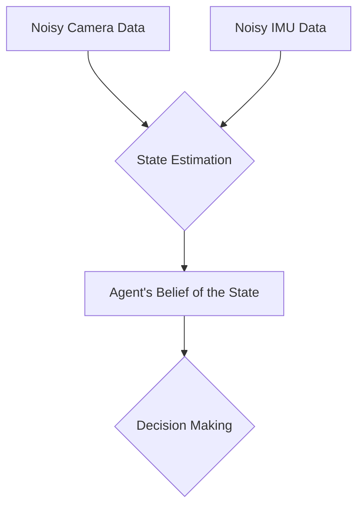

# Chapter 6: Detailed Explanation

At its core, the "brain" of a robot is a piece of software that has to answer one question over and over again: **"Given what I can see right now, what should I do next?"**

This software is the **AI Agent**. The process of seeing, thinking, and doing is the **perception-action loop**.

### The Challenge: What is the "State"?

To make a good decision, the agent needs to know the **state** of the world. But this is a huge problem. A robot's sensors are never perfect.
- A camera can't see through walls.
- A LiDAR sensor might not see a clear glass window.
- Wheel encoders can slip, leading to errors in odometry (the estimate of how far the robot has traveled).

The robot never has access to the *true* state of the world. It only has its sensor readings. **State estimation** is the process of taking all this noisy, incomplete sensor data and fusing it together to create a reliable *belief* about the state of the world. This "belief state" is what the AI agent actually uses to make decisions.

### How an Agent Decides: Agent Architectures

There are several ways to design the "thinking" part of the agent.

#### 1. Simple Reflex Agents

This is the most basic architecture. The agent's decisions are based *only* on the current sensor input, using simple "if-then" rules.
- `if (bumper_sensor == pressed) then (action = reverse)`
- `if (light_sensor < threshold) then (action = turn_on_lights)`

A Roomba vacuum cleaner is mostly a reflex agent. It doesn't have a deep understanding of your room; it just reacts to hitting walls and seeing dirt. These agents are simple and fast, but they can't handle anything complex and often get stuck in loops.

#### 2. Model-Based Agents

This is a much smarter approach. A model-based agent maintains an internal **model** of how the world works. This model allows it to predict the outcome of its actions.

- **The Model:** The agent knows "If I am at position X and I take action 'move forward', I will end up at position Y."
- **How it works:** When it needs to make a decision, it can "simulate" different action sequences in its internal model to see which one leads to the best outcome. This is the basis of planning. A GPS navigation app is a model-based agent; it uses its internal map (the model) to plan the best route for you.

### How an Agent Learns: Reinforcement Learning (RL)

For a long time, the "model" or the "reflexes" of an agent had to be programmed by a human. This is incredibly time-consuming and brittle. What if the agent could learn how to behave on its own, just through trial and error?

This is the core idea of **Reinforcement Learning (RL)**.

The setup is simple and powerful:
- The **Agent** (the robot's software) is placed in an **Environment** (the world, or a simulation of it).
- The agent is in a certain **State** (e.g., its position and what its sensors see).
- It can choose from a set of **Actions** (e.g., move forward, turn left, grab).
- After it takes an action, the environment gives it a **Reward** (a positive number for good actions, a negative number for bad ones).

The agent's one and only goal is to make choices that maximize its total cumulative reward.

#### Example: Teaching a Robot to Walk

Imagine you want to teach a humanoid robot to walk using RL.
- **Environment:** A physics simulation of the robot and the ground.
- **State:** The angles of all the robot's joints and its velocity.
- **Actions:** The amount of torque to apply to each joint motor.
- **Reward:**
    - `+1` for every second it stays upright.
    - `+10` for every meter it moves forward.
    - `-100` if it falls over (this is a big penalty).

The RL algorithm starts by making completely random movements. At first, the robot will fall over immediately. But by chance, some sequences of actions will let it stay upright for a fraction of a second longer than others. These actions will be "reinforced." Over millions of trials in simulation, the agent slowly learns a complex strategy—a **policy**—that maps its current state to the correct motor torques to produce a stable walking gait.

The **policy (π)** is the final product of the RL process. It *is* the robot's brain. It's a function that takes the current state as input and outputs the best action to take to maximize future rewards. Modern Physical AI systems, like the ones from Boston Dynamics, use techniques heavily inspired by RL to achieve their incredible agility.
