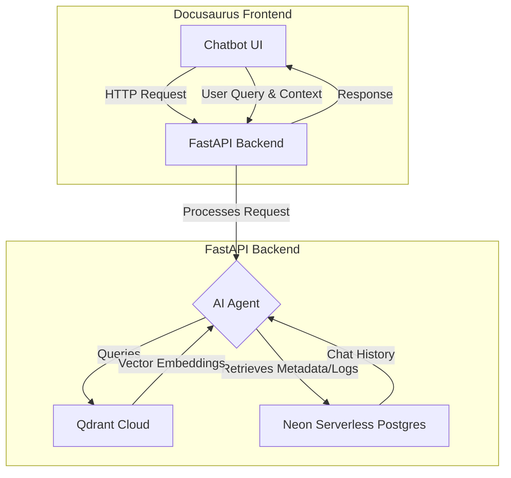

# RAG Chatbot: Technical Implementation

This document outlines the high-level architecture and data flow for the RAG-based AI chatbot integrated into the "Physical AI & Humanoid Robotics" textbook.

## 1. High-Level Architecture

The chatbot system is composed of a frontend component running in the Docusaurus application and a backend service that handles the AI logic.



-   **Frontend:** A floating chatbot UI built with React, integrated into the Docusaurus site.
-   **Backend:** A Python-based service using **FastAPI** for handling API requests.
-   **AI Brain:** An AI agent built with a framework like **LangChain** or **LlamaIndex** (which abstract over the OpenAI SDK) to orchestrate the RAG pipeline.
-   **Vector Store:** **Qdrant Cloud** is used to store the vector embeddings of the textbook content. Its role is to enable fast similarity searches.
-   **Metadata & Log Store:** A **Neon Serverless Postgres** database is used to store chat history and metadata about the textbook content (e.g., which chapter a specific text chunk came from).

## 2. RAG Behavior & Data Flow

The chatbot is designed to answer questions *only* from the book's content, with two primary modes of operation.

### Mode A: Answering from the Entire Book

This is the default mode. The user asks a general question.

**Data Ingestion Flow (Done Once):**

1.  **Load Content:** A script reads all the Markdown files from the `/docs` directory.
2.  **Chunking:** The content of each file is broken down into smaller, semantically meaningful chunks.
3.  **Embedding:** Each chunk is sent to an embedding model (e.g., OpenAI's `text-embedding-ada-002`) to be converted into a vector embedding (a list of numbers).
4.  **Storage:**
    -   The vector embedding and a unique ID for the chunk are stored in **Qdrant**.
    -   The original text of the chunk, its unique ID, and its source (e.g., Chapter 3, Section 2) are stored in the **Postgres** database.

**Retrieval + Response Flow (Happens on each query):**

1.  **User Query:** The user asks a question, e.g., "What is the Zero Moment Point?"
2.  **Query Embedding:** The user's question is converted into a vector embedding using the same model.
3.  **Similarity Search:** The backend queries **Qdrant** with the user's query vector. Qdrant returns the IDs of the most similar/relevant text chunks from the textbook.
4.  **Context Retrieval:** The backend uses the retrieved IDs to look up the original text of those chunks from the **Postgres** database.
5.  **Prompt Augmentation:** The backend constructs a prompt for a powerful language model (e.g., GPT-4). The prompt looks something like this:
    ```
    You are a helpful assistant for the textbook "Physical AI & Humanoid Robotics". Answer the user's question based *only* on the following context. If the answer is not in the context, say "I'm sorry, I don't have enough information to answer that question from the textbook."

    Context:
    ---
    [Text of chunk #1]
    [Text of chunk #2]
    [Text of chunk #3]
    ---

    User Question: What is the Zero Moment Point?
    ```
6.  **LLM Response:** The prompt is sent to the LLM, which generates an answer based on the provided context.
7.  **Return to User:** The answer is streamed back to the user in the chatbot UI.

### Mode B: Answering from User-Selected Text

This mode allows the user to highlight a specific paragraph or section and ask a question about it.

**Flow:**

1.  **User Selection:** The user highlights text on the Docusaurus page.
2.  **Context Passing:** The frontend passes both the user's question *and* the highlighted text (the "context") to the FastAPI backend in the API call.
3.  **No Retrieval Needed:** In this mode, the backend **skips** the query to Qdrant and Postgres. It already has the exact context it needs.
4.  **Prompt Augmentation:** The backend constructs a similar prompt as before, but this time, the "Context" section is filled *only* with the text the user highlighted.
5.  **LLM Response:** The process continues as before. This ensures the answer is strictly focused on the selected text.

## 3. Chunking Strategy

A good chunking strategy is critical for RAG performance.

-   **Method:** Recursive Character Text Splitting.
-   **Chunk Size:** Aim for a chunk size of around 1000 characters.
-   **Chunk Overlap:** Use an overlap of about 150 characters. This helps to ensure that semantic meaning isn't lost at the boundary between two chunks.
-   **Separators:** Split first by `\n\n` (new paragraphs), then by `\n` (new lines), and finally by spaces. This tends to keep related sentences and ideas together within a single chunk.
-   **Metadata:** Crucially, each chunk must be stored with metadata identifying its source file (e.g., `docs/4-humanoid-robots/03-detailed-explanation.md`), which is essential for verification and potential citation.
